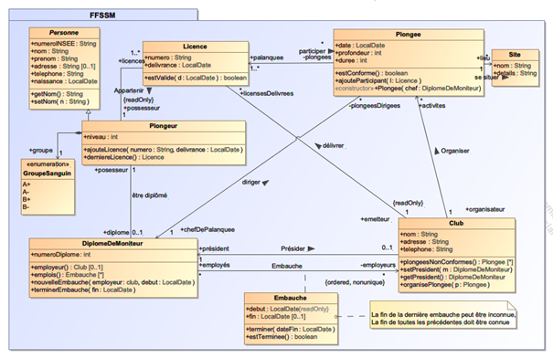

# Exercice UML FFSSM - Implémentation Java

## Description

Ce projet consiste à implémenter en Java les classes issues du diagramme de classes UML de l'exercice FFSSM (Fédération Française de Sports Sous-Marins) et à écrire des tests unitaires significatifs.



*Diagramme de classes UML du système FFSSM*

## Objectifs

À partir du diagramme de classes de l'exercice UML FFSSM, vous devez :

1. **Implémenter en Java** les classes suivantes :
   - `Club`
   - `Plongeur`
   - `DiplomeDeMoniteur` 
   - `Plongee`
   - `Licence`

2. **Écrire des tests unitaires significatifs** pour valider le comportement de ces classes

## Point de départ

Le projet fourni est **incomplet**. Vous trouverez des commentaires `TODO` dans le code source qui indiquent les éléments à implémenter.

### Structure du projet

```
src/
├── main/java/FFSSM/
│   ├── Club.java
│   ├── Embauche.java
│   ├── GroupeSanguin.java
│   ├── Licence.java
│   ├── DiplomeDeMoniteur.java
│   ├── Personne.java
│   ├── Plongee.java
│   ├── Plongeur.java
│   └── Site.java
└── test/java/FFSSM/
    └── (tests à créer)
```

## Technologies utilisées

- **Java** (version 21 ou supérieure recommandée)
- **Maven** pour la gestion des dépendances et la construction du projet
- **JUnit** pour les tests unitaires
- **LocalDate** (package `java.time`) pour la représentation des dates

## Instructions

1. **Cloner le repository** :
   ```bash
   git clone https://github.com/bastide/FFSSM_Enonce.git
   cd FFSSM_Enonce
   ```

2. **Analyser le code existant** et identifier les `TODO` à compléter

3. **Implémenter les classes manquantes** en respectant le diagramme UML fourni

4. **Créer des tests unitaires** dans le dossier `src/test/java/FFSSM/`

5. **Compiler et tester** :
   ```bash
   mvn compile
   mvn test
   ```

## Notes importantes

- **Gestion des dates** : Utilisez exclusivement la classe `LocalDate` du package `java.time` pour représenter les dates
- **Respect du diagramme UML** : L'implémentation doit strictement suivre le diagramme de classes fourni
- **Tests significatifs** : Les tests doivent couvrir les cas normaux, les cas limites et les cas d'erreur
- **Code compilable** : À la fin de l'exercice, le projet doit compiler sans erreur

## Évaluation

L'évaluation portera sur :
- La conformité de l'implémentation avec le diagramme UML
- La qualité et la couverture des tests unitaires
- La lisibilité et la qualité du code Java
- Le respect des bonnes pratiques de programmation orientée objet

## Ressources

- [Documentation Java LocalDate](https://docs.oracle.com/javase/8/docs/api/java/time/LocalDate.html)
- [Guide JUnit](https://junit.org/junit5/docs/current/user-guide/)
- [Maven Getting Started](https://maven.apache.org/guides/getting-started/)